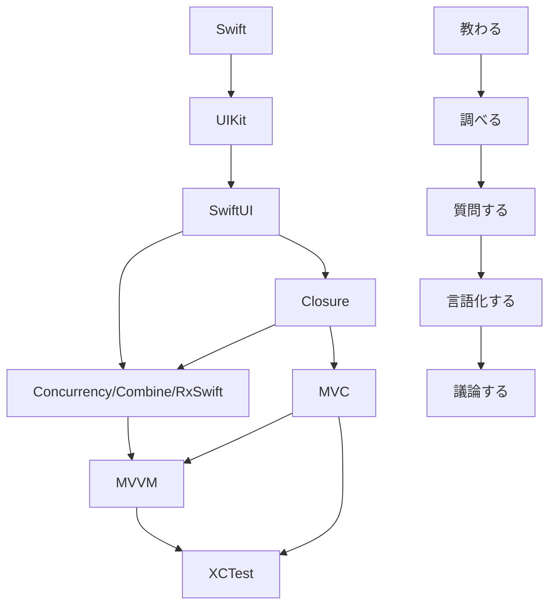

# 🌕 TechAccel2023 🌘
## 🤖 目指す成果物 🤖

## 🐍 開発フロー 🐍
1. [TechAccel2023]()を`fork`する
2. `fork`した`repository`に`slack`で通知設定をする
3. `fork`した`repository`を`clone`する
4. `セットアップ手順`に従いセットアップ
5. `Issue`に従い施策を進める
6. `fork`した`repository`からブランチを切る
7. `PR`を出し、approveをもらったら`fork`した`repository`の親ブランチにマージする

## 🚀 セットアップ 🚀
### Intelチップ
### Appleチップ

## ⚠️ 開発規約 ⚠️
- あたたかいコミュニケーションで進めてください🥹

## ⚒️ 使用技術 ⚒️
#言語  
`#Swift`  

#UI  
`#SwiftUI` `#UIKit`  

#非同期処理  
`#RxSwift` `#RxCocoa` `#Concurrency` `#Combine`  

#アーキテクチャ  
`#MVVM`  

#テスト  
`#XCText` `#mockolo`  

#補助  
`#SwiftLint` `#SwiftGen`  
`#makefile` `#bundler`  
`#XcodeGen` `#SPM` `#danger` `#pr_template` 

## ロードマップ

